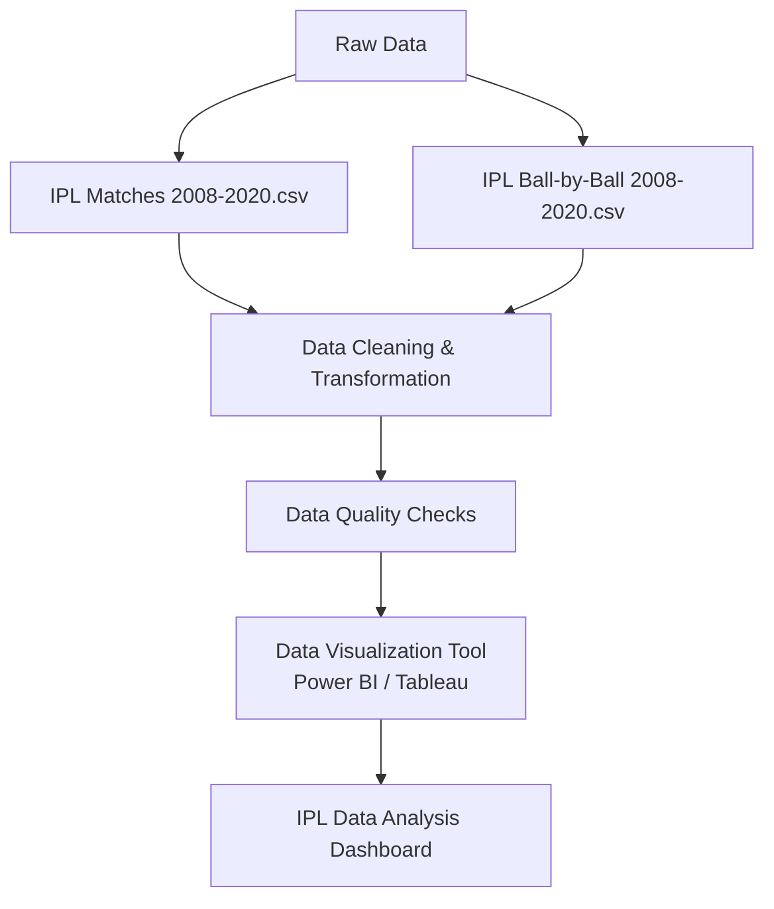

# IPL Data Analysis Dashboard (2008-2020)

## Project Overview

This project analyzes comprehensive data from the Indian Premier League (IPL) matches played between 2008 and 2020. The goal is to provide insights into player performance, team statistics, and match outcomes through a series of key performance indicators and data visualizations.

## Datasets

### 1. IPL Matches 2008-2020.csv
Contains metadata for each match including:
- Match ID
- Date
- Venue
- Competing teams
- Toss winner
- Toss decision
- Final winner

### 2. IPL Ball-by-Ball 2008-2020.csv
Provides granular, ball-by-ball data for each match, detailing:
- Runs scored
- Wickets taken
- Batsman and bowler involved
- Match events

## Dashboard Insights

The analysis dashboard presents the following key metrics and visualizations:

- **Total Matches Played** (Count)
- **Top Batsmen by Most Runs**
- **Top Bowlers by Most Wickets**
- **Most Fours and Sixes Hit by Batsmen**
- **Team Win Percentage Analysis**
- **Match Result Breakdown** (wins by runs, wins by wickets)
- **Top 5 Overall Players**

## Workflow

## Key Features

### Player Analytics
- Individual batsman performance metrics
- Bowler effectiveness analysis
- Boundary hitting statistics (4s and 6s)
- Overall player rankings

### Team Performance
- Win percentage calculations
- Head-to-head team comparisons
- Venue-based performance analysis
- Toss impact on match outcomes

### Match Insights
- Result type distribution
- Seasonal performance trends
- Venue statistics
- Historical match patterns

## Technical Implementation

1. **Data Preprocessing**: Clean and validate both CSV datasets
2. **Data Integration**: Merge match-level and ball-by-ball data
3. **Feature Engineering**: Calculate derived metrics and KPIs
4. **Visualization**: Create interactive dashboard with filtering capabilities
5. **Analysis**: Generate actionable insights from the processed data

## Getting Started

1. Ensure you have the required CSV files in the project directory
2. Load the data into your preferred visualization tool
3. Apply the data transformation steps
4. Configure the dashboard visualizations
5. Validate the calculated metrics and insights

## Data Period
**2008 - 2020** (13 seasons of IPL data)

---

*This dashboard provides comprehensive insights into IPL performance metrics, enabling data-driven analysis of cricket statistics and trends.*
